# 🤖 Deep-Dive Agentic Architecture Documentation
# AICTE Multi-Agent College Management System

## 1. System Philosophy: Role-Based Agent Swarm
The system maps **Institutional Roles** (Principal, HOD, Faculty, Student) to **Specialized Agents** that possess specific:
1.  **Knowledge Bases** (e.g., AICTE Handbook for Compliance Agent).
2.  **Toolkits** (e.g., Database access for Academic Agent).
3.  **Permissions** (RBAC-enforced via `rbac.py`).

### High-Level Interaction Flow

```mermaid
sequenceDiagram
    participant User
    participant API as FastAPI Gateway
    participant Orch as 🤖 Orchestrator
    participant Agent as 🎓 Specialized Agent
    participant Tools as �️ Tool/DB

    User->>API: "What is the attendance for CS101?"
    API->>Orch: Context: {Role: Faculty, User: John}
    Orch->>Orch: Analyze Intent (NLP/Keywords)
    Orch->>Agent: Route to AcademicAgent
    Agent->>Agent: Check Permissions (Can view attendance?)
    Agent->>Tools: fetch_attendance(course_id="CS101")
    Tools-->>Agent: Returns JSON Data
    Agent->>Agent: Formulate Response (LLM)
    Agent-->>Orch: "Attendance is 85%..."
    Orch-->>User: Final Response
```

---

## 2. Agent Inventory & Capabilities

### 2.1 🎓 Academic Operations Agent
**Primary Users**: Faculty, HOD, Principal, Student
**Responsibility**: Managing day-to-day academic lifecycle.

| Capability | Tools Used | Description |
| :--- | :--- | :--- |
| **Attendance Tracking** | `fetch_attendance` | Analyzes daily attendance trends. |
| **Shortage Detection** | `identify_attendance_shortage` | Flags students below 75% threshold. |
| **OBE Analysis** | `calculate_co_attainment` | Computed Course Outcome - Program Outcome mapping. |
| **Document Gen** | `generate_shortage_letters` | Auto-creates official warning letters in PDF. |

### 2.2 🏆 Accreditation & Quality Agent
**Primary Users**: IQAC Coordinator, Principal
**Responsibility**: Ensuring NBA/NAAC compliance and SAR generation.

#### Internal Workflow: SAR Generation

### 2.3 💰 Finance & Purchase Agent
**Primary Users**: Accounts Officer, Principal, HOD (for specific budgets)
**Responsibility**: Budget utilization, Purchase Orders, Payroll.

-   **Tools**:
    -   `check_budget_status(dept_id)`
    -   `create_purchase_request(items)`
    -   `forecast_expenditure()`

### 2.4 👥 HR & Administrative Agent
**Primary Users**: Registrar, Admin
**Responsibility**: Recruitment, Leave Management, Service Books.

-   **Tools**:
    -   `fetch_leave_balance(staff_id)`
    -   `schedule_interview(candidate_id)`
    -   `generate_appointment_letter()`

---

## 3. The Orchestrator Brain (`orchestrator.py`)

The Orchestrator uses a 3-Step Routing Protocol:
1.  **Direct Role Routing**: If the user is logged in as a specialized role (e.g., "Accreditation Manager"), it prioritizes that agent.
2.  **Intent Keyword Analysis**: Scores user query against topics.
    *   *Example*: "Marks", "Result" -> **Examination Agent**.
    *   *Example*: "Salary", "Budget" -> **Finance Agent**.
3.  **Semantic Fallback**: If no specific intent is found, it uses its own RAG (Retrieval Augmented Generation) to answer general queries using the System Knowledge Base.

---

## 4. Role-Based Access Control (RBAC) integration

Every Agent Action is wrapped in a Permission Check.

| Role | Permissions | Accessible Agents (Primary) |
| :--- | :--- | :--- |
| **Student** | `VIEW_OWN_PROFILE` | Academic (Self), Exam (Self), Student Services |
| **Faculty** | `EDIT_GRADES`, `VIEW_ANALYTICS` | Academic, Research, HR (Self) |
| **HOD** | `APPROVE_LEAVE`, `VIEW_ALL_PROFILES` | All of Faculty + Finance (Dept Budget), Admin (Dept Staff) |
| **Principal** | `GENERATE_REPORTS`, `ALL_ACCESS` | **ALL AGENTS** |

---

## 5. Available Tools Registry

The agents reference a shared library of tools located in `app/tools/`.

### `database_tools.py`
-   `fetch_attendance(student_id, course_id)`
-   `get_student_data(student_id)`
-   `get_course_data(course_id)`

### `document_tools.py`
-   `generate_attendance_shortage_letter(student_data)`: Generates PDF.
-   `generate_sar_report(data)`: Generates Markdown/PDF.

### `calculation_tools.py`
-   `calculate_co_attainment(marks)`: Returns OBE metrics.
-   `forecast_budget(history)`: Returns linear regression forecast.

---

## 6. User Role Capabilities

Detailed breakdown of what each primary agentic user can perform within the system.

### 👨‍🏫 Faculty
*   **Academic Management**:
    *   View and edit student grades/marks.
    *   Track daily attendance and receive shortage alerts.
    *   View personal teaching calendar and workload distribution.
*   **Research & Analytics**:
    *   Analyze Course Outcome (CO) attainment levels.
    *   View own research grant status.

### 👔 Head of Department (HOD)
*   **Team Oversight**:
    *   **Task Assignment**: Assign administrative or academic tasks to faculty (e.g., "Assign Exam Duty to Prof. Sharma").
    *   **Workload Monitoring**: View utilization charts (Teaching vs. Research vs. Admin) for all department staff.
    *   **Leave Management**: Approve or reject faculty leave requests.
*   **Strategic Planning**:
    *   Oversee department budget utilization.
    *   View all student profiles and department-level academic performance.

### 🎓 Principal / Head of Institute
*   **Institutional Governance**:
    *   **System-Wide Status**: Access high-level health dashboards for all modules (Finance, Exam, Academic).
    *   **Reports**: Generate comprehensive reports (Annual Report, AQAR, NIRF Data).
    *   **Approvals**: Final authority on Budget Proposals and critical compliance documents.
    *   **Global Search**: unrestricted access to query any metric across the institution.

### 🎒 Student
*   **Personal Dashboard**:
    *   View own attendance percentage and shortage warnings.
    *   Check semester results and internal marks.
    *   Download fee receipts and study certificates.

---

## 7. Extended Architecture & Workflows

### 7.1 Finance Approval Workflow
The system orchestrates multi-step approval processes for budget and purchase requests.

### 7.2 System Health & Critical Path Analysis
The Orchestrator continuously monitors the health of sub-agent modules to ensure reliability.

